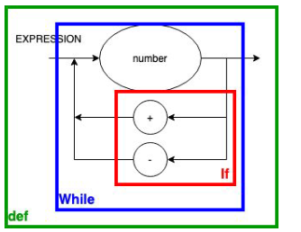
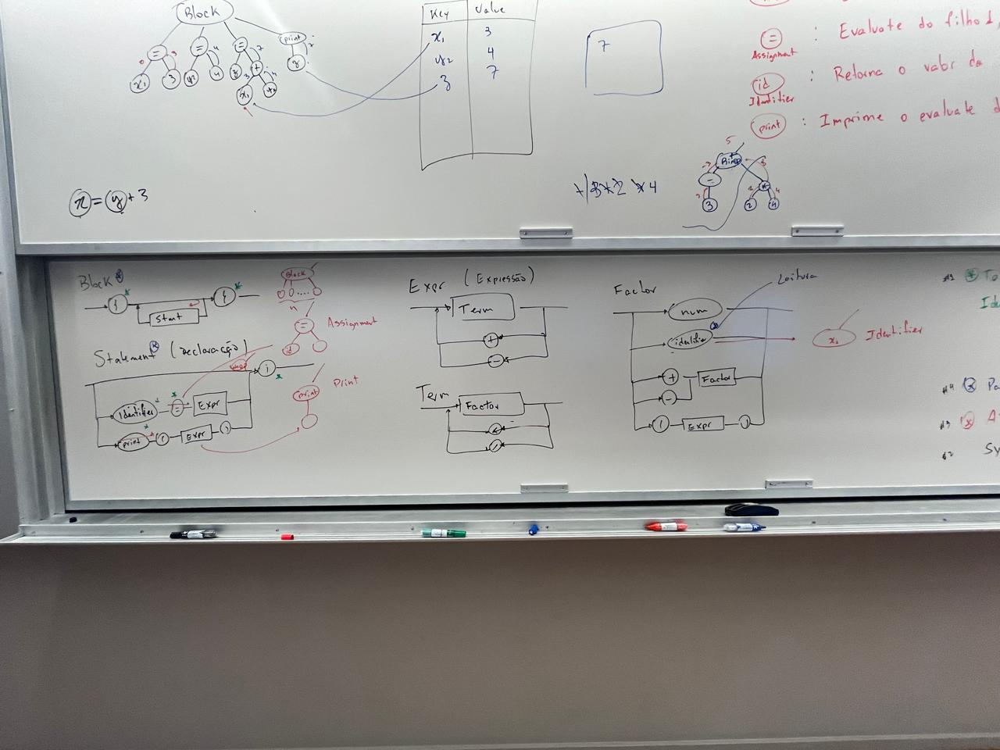
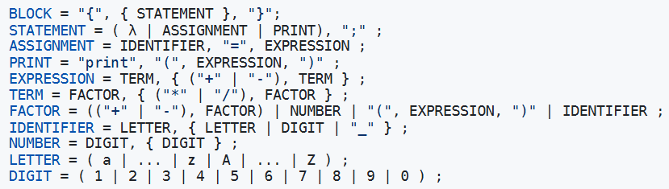
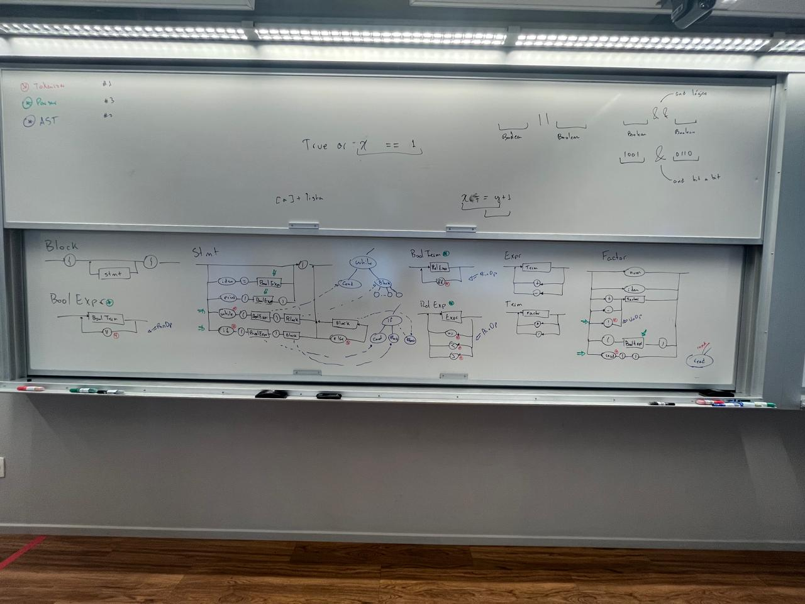
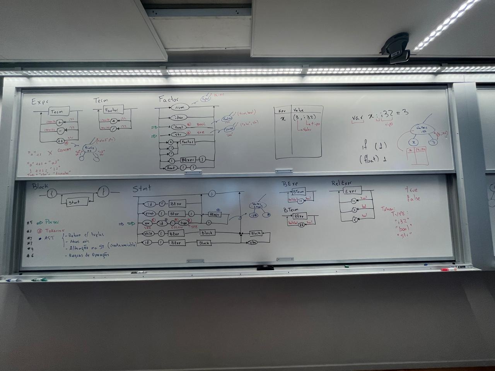

# projeto_compilador

# Status dos Testes

# Diagrama sintático da versão 1.0

# Diagrama sintático da versão 1.1

# Diagrama sintático da versão 1.2 e 2.0

# Diagrama sintático e EBNF da versão 2.1

# Diagrama sintático e EBNF da versão 2.2

# Diagrama sintático e EBNF da versão 2.3

